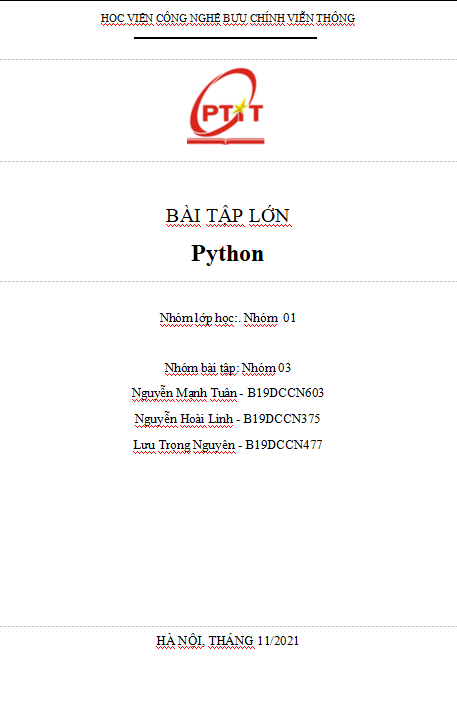
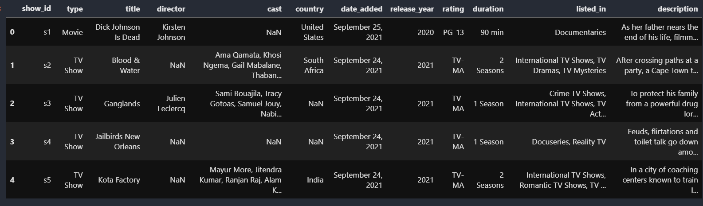
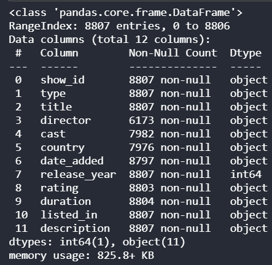
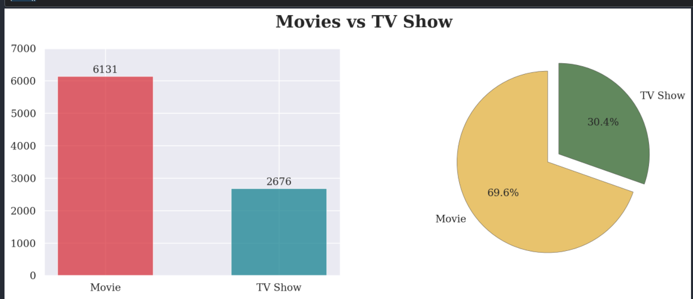
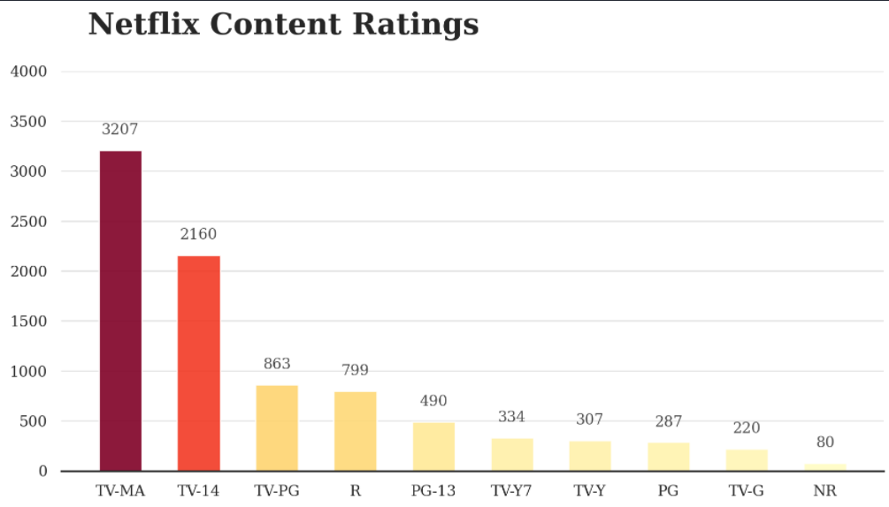
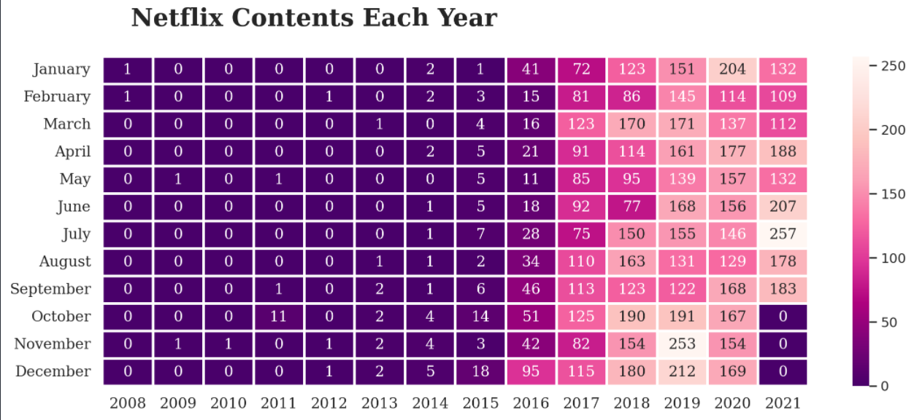
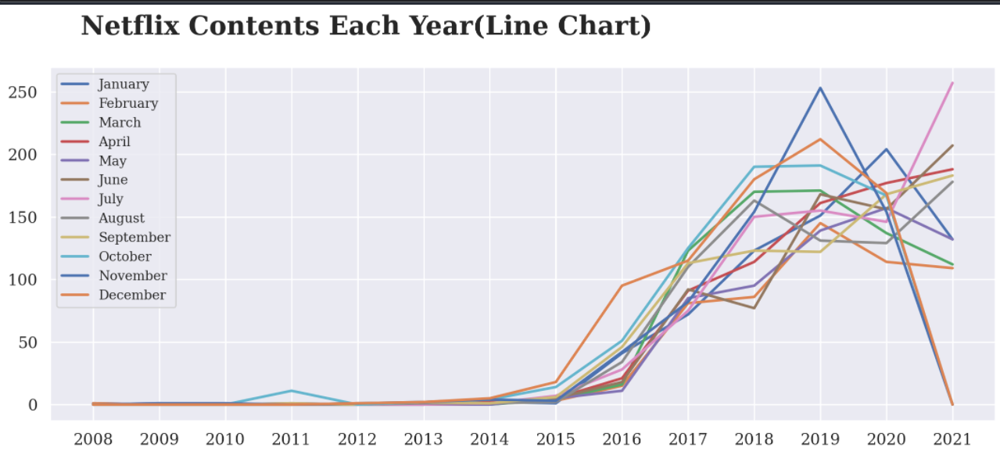
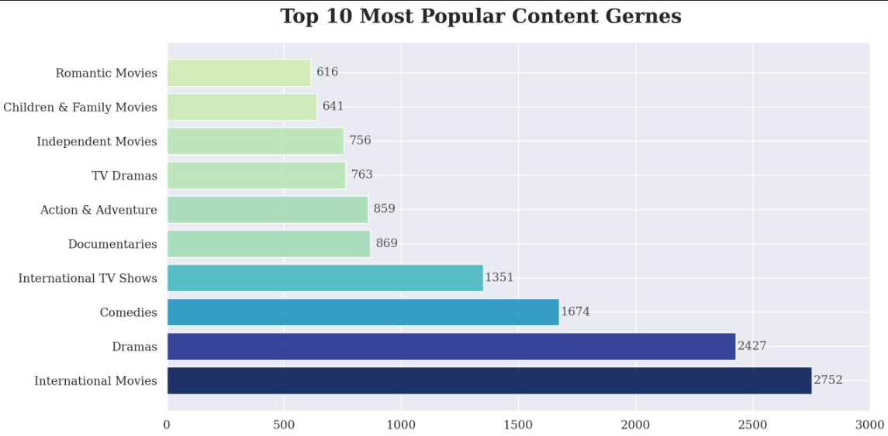
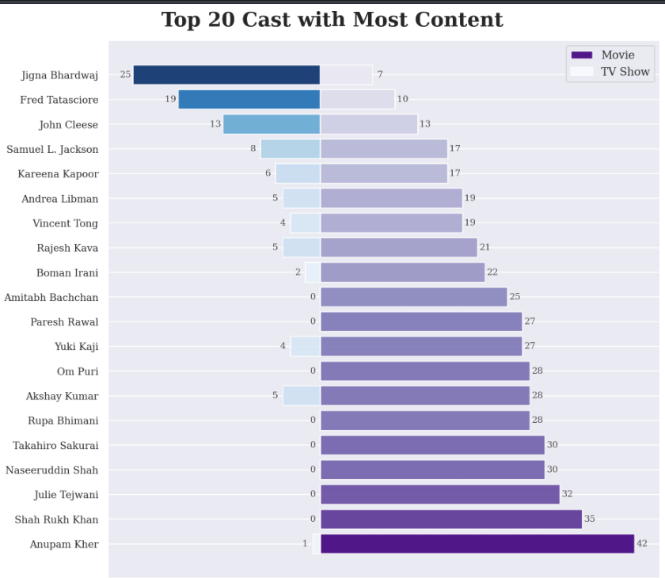
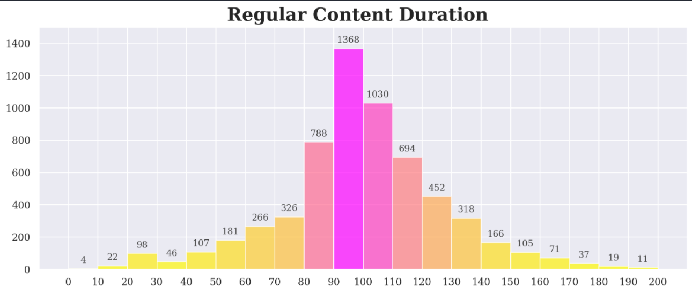

## Data Visualization với các thư viện **matplotlib**, **seaborn** trong python
---
1. Lý do chọn đề tài:
> Trực quan hóa dữ liệu là biểu diễn bằng đồ thị các thông tin và dữ liệu để cung cấp một góc nhìn dễ tiếp cận để xem và hiểu các xu hướng, ngoại lệ và sự phân bố trong dữ liệu.

2. Về dữ liệu: Netflix Movies and TV Shows

> Netflix là một trong những nền tảng truyền phát video và truyền thông phổ biến nhất. Họ có hơn 8000 bộ phim hoặc chương trình truyền hình trên nền tảng của mình, tính đến giữa năm 2021, họ có hơn 200 triệu người đăng ký trên toàn cầu. Dữ liệu được sử dụng trong báo cáo này bao gồm danh sách tất cả các bộ phim và chương trình truyền hình có sẵn trên Netflix, cùng với các thông tin chi tiết như - dàn diễn viên, đạo diễn, xếp hạng, năm phát hành, thời lượng, v.v.

> Nguồn: [Kaggle Competition](https://www.kaggle.com/shivamb/netflix-shows)

3. [Link notebook](https://github.com/Kkyn-ltcode/Netflix-Shows)

4. Chi tiết về notebook
- import các thư viện cần thiết
```python
from collections import Counter
# bộ đếm

import pandas as pd
# thư viện để xử lý dữ liệu dạng bảng, dùng để lọc, kết hợp dữ liệu

import matplotlib.pyplot as plt
import seaborn as sns
# thư viện dùng để trực quan hóa dữ liệu

import numpy as np
# xử lý số liệu, tính toán

import warnings
warnings.filterwarnings(action='ignore')
# ẩn một vài cảnh báo của matplotlib và seaborn
```
---
- Đọc dữ liệu từ file csv
```python
data = pd.read_csv('netflix_titles.csv')
data.head() # hiển thị 5 dòng đầu
```

> Thông tin về các thuộc tính trong data
> - show_id: id của từng dòng data
> - type: gồm có TV Show và Movie
> - title: tên phim
> - director: đạo diễn
> - cast: diễn viên
> - country: quốc gia sản xuất
> - date_added: ngày phát sóng trên netflix
> - release_year: năm sản xuất
> - rating: đánh giá
> - duration: thời lượng
> - listed_in: thể loại
> - description: lời giới thiệu
---
- Kiểm tra dữ liệu
```python
data.info()
```

> Có một vài thuộc tính bị thiếu dữ liệu nhưng không đáng kể
---

- Biểu đồ phân bổ thể loại phim trên Netflix
```python
sns.set(style='darkgrid')
# set background của biểu đồ

fig, axes = plt.subplots(1, 2, figsize=(14, 5), dpi=200)
# tạo 1 khung hình với kích thước 14 inches chiều rộng, 5 inches chiều dài
# với độ phân giải 200 pixes gồm 2 hệ trục trên cùng một dòng

axes[0].bar(data['type'].unique(), data['type'].value_counts(), linewidth=0.7, alpha=0.7, 
            color=['#d72631', '#077b8a'], width=0.55)
# tạo biểu đồ cột trên hệ trục thứ nhất
# data['type'].unique() lọc ra các thể loại khác nhau trong thuộc tính type
# data['type'].value_counts() đếm số lượng các sản phẩm trong 1 thể loại

for i in data['type'].unique():
    axes[0].annotate(f"{data['type'].value_counts()[i]}", (i, data['type'].value_counts()[i] + 200), 
                     ha='center', va='center', family='serif')
# tạo chú thích trên các cột
# trong hàm annotate, biến đầu tiên là giá trị hiển thị trên biểu đồ,
# biến thứ hai là cặp tọa độ của giá trị,
# biến thứ ba và thứ tư điều chỉnh trọng tâm của khung text chứa giá trị
# biến cuối là chỉnh phông chữ

axes[0].set_ylim([0, 7000])
# đặt giới hạn cho trục y

axes[0].set_xticklabels(data['type'].unique(), family='serif', size=12)
# điều chỉnh label của trục x

axes[0].set_yticklabels(np.arange(0, 7001, 1000),family='serif', size=12)    
 # điều chỉnh label của trục y
    
axes[1].pie(data['type'].value_counts(), explode=[0, 0.15], labels=data['type'].unique(), 
            colors=['#e3b448', '#3a6b35'], autopct='%1.1f%%', startangle=90,
            wedgeprops={'edgecolor': '#322e2f', 'linestyle': 'solid', 'linewidth': 0.4, 'alpha': 0.8}, 
            textprops={'family': 'serif', 'size': 12})
# tạo biểu đồ quạt
# autopct: lấy 1 chữ số sau dấu phẩy
# statrangle: chỉnh góc quay ngược 90 độ so với trục x
# wedgeprops: điều chỉnh thuộc tính của các hình quạt: màu cạnh, kích thước, màu sắc đường viền, độ sáng
# textprops: điều chỉnh thuộc tính của các label bên trong hình quạt: phông chữ, kích thước...

fig.text(0.4, 0.95, 'Movies vs TV Show', family='serif', size=20, weight='bold')
# tiêu đề của biểu đồ

plt.show()
```


---
- Biểu đồ phân bổ đánh giá
```python
sns.set_style('white')
fig, ax = plt.subplots(1, 1, figsize=(10, 5), dpi=200)
ratings = data['rating'].value_counts()[:10]
# top 10 phổ biến thịnh hành trên Netflix

data_hight= [x / max(ratings.values) for x in ratings.values]
# so sánh các giá trị với giá trị lớn nhất trong ratings
my_cmap = plt.cm.get_cmap('YlOrRd')
colors = my_cmap(data_hight)
# tạo 1 bảng màu tương ứng với độ lớn giá trị trong data_hight

ax.bar(ratings.index, ratings.values, width=0.55, alpha=0.9, color=colors)
# biểu đồ cột

for i in ratings.index:
    ax.annotate(f'{ratings[i]}', (i, ratings[i] + 200), ha='center', va='center', size=10, 
                weight='light', family='serif', color='#4a4a4a')

for i in ['top', 'right', 'left']:
    ax.spines[i].set_visible(False)
# ẩn cạnh trên, phải, trái của trục tọa độ

ax.set_ylim([0, 4000])
ax.set_xticklabels(ratings.index, family='serif', size=10)
ax.set_yticklabels(np.arange(0, 4001, 500), family='serif', size=10)
ax.grid(axis='y', linestyle='-', alpha=0.5)
# tạo đường kẻ trên trục y

fig.text(0.15, 0.95, 'Netflix Content Ratings', family='serif', size=20, weight='bold')
plt.show()
```


---
- Biểu đồ phân bố số lượng các sản phẩm theo thời gian trên Netflix
  - Heatmap
```python
date = data[['date_added']].dropna()
# loại bỏ giá trị bị mất

date['year'] = date['date_added'].apply(lambda x: str(x).split(' ')[-1])
# lấy năm phát sóng trong chuỗi

date['month'] = date['date_added'].apply(lambda x: str(x).split(' ')[0])
# lấy tháng phát sóng trong chuỗi

month_list = ['January', 'February', 'March', 'April', 'May', 'June', 'July',
              'August', 'September', 'October', 'November', 'December']

netflix_date = date.groupby('year')['month'].value_counts().unstack().fillna(0)[month_list].T
# gộp các giá trị theo năm và đếm số sản phẩm theo từng tháng
# rồi biểu diễn dưới dạng bảng, với các giá trị không tồn tại thì điền 0
fig, ax = plt.subplots(1, 1, figsize=(13,5), dpi=200)

sns.heatmap(netflix_date, cmap='RdPu_r', annot=True, ax=ax, edgecolor='white', linewidth=2, 
            fmt='g', annot_kws={'family': 'serif'})
# tạo heatmap
# annot: hiển thị giá trị từng ô
# annot_kws: điều chỉnh thuộc tính của annot
# fmt: đặt các giá trị là số nguyên

plt.xticks(np.arange(0.5, len(netflix_date.columns), 1), netflix_date.columns, family='serif', size=12)
# đặt giá trị cho trục x, biến đầu là vị trí của các label trên trục
plt.yticks(np.arange(0.5, len(netflix_date.index), 1), netflix_date.index, family='serif', size=12)
plt.xlabel('')
plt.ylabel('')
fig.text(0.15, 0.95, 'Netflix Contents Each Year', family='serif', size=20, weight='bold')
plt.show()
```

 - Lineplot
```python
sns.set_style('darkgrid')
fig, ax = plt.subplots(1, 1, figsize=(13,5), dpi=200)

for month in month_list:
    month_data = netflix_date.loc[month]
    # giá trị theo từng tháng
    plt.plot(month_data.index, month_data.values, label=month, linewidth=2)
# vẽ từng đường tương ứng với các tháng

plt.xticks(netflix_date.columns, family='serif', size=12)
plt.yticks(np.arange(0, 251, 50), family='serif', size=12)
plt.legend(prop={'family': 'serif', 'size': 10})
# hiển thị chú thích

fig.text(0.15, 0.95, 'Netflix Contents Each Year(Line Chart)', family='serif', size=20, weight='bold')
plt.show()
```


---
- Top 10 thể loại thịnh hành trên Netflix
```python
content_types = data['listed_in'].apply(lambda x: x.split(', '))
# tách từng thể loại trong 1 chuỗi 

content_counter = Counter()
# đếm số lượng sản phẩm trong 1 thể loại

for content in content_types.iteritems():
    content_counter.update(content[1])
# duyệt từng dòng tron content_type
# iteritems trả lại 1 tuple (x, y) vói x là số thứ tự từ 0, y là list các thể loại

items = []
# chứa các thể loại phim

popularity = []
# chứa số lượng sản phẩm tương ứng với từng thể loại

for item in content_counter.most_common(len(content_counter)):
    items.append(item[0])
    popularity.append(item[1])

popularity_norm = [x / max(popularity) for x in popularity]
popularity_cmap = plt.cm.get_cmap('YlGnBu')
colors = popularity_cmap(popularity_norm)
# tạo bảng màu

fig, ax = plt.subplots(1, 1, figsize=(13, 7), dpi=200)
ax.barh(items[:10], popularity[:10], color=colors, alpha=0.9)
# tạo biểu đồ cột nằm ngang, chỉ lấy 10 giá trị lớn nhất

for i in range(10):
    ax.annotate(f'{popularity[i]}', (popularity[i] + 70, items[i]), ha='center', va='center', 
                family='serif', size=12, color='#4a4a4a')
    
ax.set_xlim([0, 3000])
ax.set_xticklabels(np.arange(0,3001, 500), family='serif', size=12)
ax.set_yticklabels(items[:10], family='serif', size=12)
fig.text(0.25, 0.92, 'Top 10 Most Popular Content Gernes', weight='bold', family='serif', size=20)
plt.show()
```


---
- Top 20 diễn viên có nhiều sản phẩm nhất trên Netflix
```python
cast = data[['cast', 'type']].dropna()
# lọc lấy diễn viên và thể loại, bỏ các giá trị bị mất

cast['cast'] = cast['cast'].apply(lambda x: x.split(', '))
cast_type = pd.DataFrame(columns=['cast', 'type'])
# cast_type là 1 Dataframe hiển thị diễn viên và thể loại phim tham gia

for info in cast.itertuples():
    for cast_name in info[1]:
        cast_type = cast_type.append({'cast': cast_name, 'type': info[2]}, ignore_index=True)
```
```python
top20_cast = cast_type['cast'].value_counts()[:20]
top20_cast_movie = cast_type[(cast_type['cast'].isin(top20_cast.index)) & (cast_type['type'] == 'Movie')]['cast'].value_counts()
# số lượng diễn viên tham gia movie

top20_cast_tv = top20_cast - top20_cast_movie
# số lượng diễn viên tham gia tv show

fig, ax = plt.subplots(1, 1, figsize=(10, 10), dpi=200)

movie_norm = [x / max(top20_cast_movie) for x in top20_cast_movie]
movie_cmap = plt.cm.get_cmap('Purples')
movie_colors = movie_cmap(movie_norm)
# bảng màu của movie

tv_norm = [x / max(top20_cast_tv) for x in top20_cast_tv]
tv_cmap = plt.cm.get_cmap('Blues')
tv_colors = tv_cmap(tv_norm)
# bảng màu của tv show

ax.barh(top20_cast_movie.index, top20_cast_movie.values, label='Movie', 
        alpha=0.9, color=movie_colors)
# biểu đồ cột ngang của movie

ax.barh(top20_cast_tv.index, -top20_cast_tv.values, label='TV Show', 
        alpha=0.9, color=tv_colors)
# biểu đồ cột ngang của tv show, lấy giá trị âm để cột hướng sang trái

for i in top20_cast.index:
    ax.annotate(f'{top20_cast_movie[i]}', (top20_cast_movie[i] + 1, i), ha='center', va='center', 
                family='serif', size=9, color='#4a4a4a')
    
    ax.annotate(f'{top20_cast_tv[i]}', (-top20_cast_tv[i] - 1, i), ha='center', va='center', 
                family='serif', size=9, color='#4a4a4a')

ax.set_yticklabels(top20_cast.index, family='serif', size=10)
ax.set_xticks([])
fig.text(0.2, 0.9, f'Top 20 Cast with Most Content', weight='bold', family='serif', size=20)
plt.legend(prop={'family': 'serif'})
plt.show()
```


---
- Thời lượng chủ yếu của phim trên Netflix
```python
data['duration'] = data['duration'].fillna('0')
# điền các giá trị bị thiếu = 0
duration_df = data[data['duration'].str.endswith(' min')]
# lọc các giá trị tính bằng phút

duration_df['duration'] = duration_df['duration'].apply(lambda x: int(x.split(' ')[0]))

fig, ax = plt.subplots(1, 1, figsize=(13, 5), dpi=200)
bins = np.arange(0, 201, 10)
# tạo 20 bin với độ rộng là 10 phút

num_each_bin, bins, patches =  ax.hist(duration_df['duration'], bins=bins, alpha=0.7)
# vẽ biểu đồ cột, mỗi cột là số lượng các sản phẩm có thời gian chiếu nằm trong 1 khoảng tương ứng
# num_each_bin là giá trị mỗi cột
# bins là list các khoảng có độ rộng 10 phút
# patches là list chứa các đối tượng cột

duration_norm = [x / max(num_each_bin) for x in num_each_bin]
duration_cmap = plt.cm.get_cmap('spring_r')
duration_colors = duration_cmap(duration_norm)
# tạo bảng màu

for i in range(20):
    patches[i].set_facecolor(duration_colors[i])
# đặt màu tương ứng cho mỗi cột
    
for i in range(20):
    ax.annotate(f'{int(num_each_bin[i])}', ((bins[i] + bins[i + 1]) // 2, int(num_each_bin[i]) + 50), 
                ha='center', va='center', size=10, family='serif', color='#4a4a4a')

ax.set_ylim([0, 1500])
ax.set_xticks(bins)
ax.set_xticklabels(bins, family='serif')
ax.set_yticklabels(np.arange(0, 1401, 200), family='serif')
fig.text(0.35, 0.9, 'Regular Content Duration', weight='bold', family='serif', size=20)
plt.show()
```
